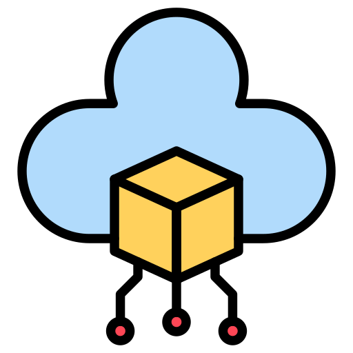
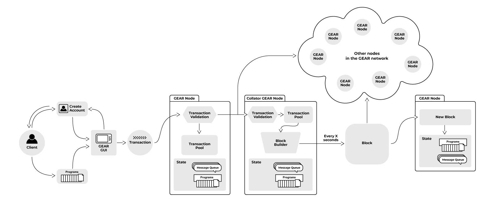

<p align="center">
  <a href="https://gear-tech.io">
    
  </a>
</p>

<h3 align="center">
Gear Protocol is a Substrate-based solution for developers, enabling anyone to run a dApp in just a few minutes.
</h3>

#

<div align="center">

[![CI][c1]][c2]
[![GitHubStars][g1]][g2]
[![Discord][d1]][d2]
[![Twitter][t1]][t2]
[![License][l1]][l2]

[c1]: https://github.com/gear-tech/gear/workflows/CI/badge.svg
[c2]: https://github.com/gear-tech/gear/actions/workflows/CI.yaml

[g1]: https://img.shields.io/github/stars/gear-tech/gear?style=flat-square&label=Stars
[g2]: https://github.com/gear-tech/gear

[t1]: https://img.shields.io/twitter/follow/gear_techs?style=social
[t2]: https://twitter.com/gear_techs

[d1]: https://img.shields.io/discord/891063355526217738?style=flat-square&label=Discord
[d2]: https://discord.com/invite/7BQznC9uD9

[l1]: https://img.shields.io/badge/License-GPL%203.0-success
[l2]: https://github.com/gear-tech/gear/blob/master/LICENSE
</div>

<p align="center">Hit the <a href="https://github.com/gear-tech/gear">:star:</a> button to keep up with daily protocol's development progress!</p>

# Getting Started

1. :open_hands: The easiest way to get started with Gear Protocol is by using the demo environment at [https://idea.gear-tech.io](https://idea.gear-tech.io).

2. :wrench: Follow the instructions from ["Getting started in 5 minutes"](https://wiki.gear-tech.io/docs/getting-started-in-5-minutes/) to compile the Rust test program to Wasm. :running: Upload and run the program on the Vara Network Testnet via [Gear Idea](https://idea.gear-tech.io/programs?node=wss%3A%2F%2Ftestnet.vara.network), send a message to a program, check how it is going.

3. :scroll: Write your own program or use one from the comprehensive [examples library](https://github.com/gear-foundation/dapps) as a basis for a convenient and swift onboarding process.

4. :computer: Download and run your Gear node locally or create your own multi-node local testnet.

5. :dolphin: Deep dive to the [Examples section](https://wiki.gear-tech.io/docs/developing-contracts/introduction) of the Gear Wiki for more details about how to implement and run your dApp with Gear.

## Run Gear Node

For Linux/MacOS users install script is available:

  ```bash
  curl --proto '=https' --tlsv1.2 -sSf https://get.gear.rs/install.sh | sh
  ```

Gear node can run in a single Dev Net mode or you can create a Multi-Node local testnet or make your own build of Gear node.

1. Compile and launch node as described in [Gear Node README](https://github.com/gear-tech/gear/tree/master/node/README.md). Alternatively, download nightly build of Gear node:

    - **macOS M-series (ARM)**: [gear-nightly-aarch64-apple-darwin.tar.xz](https://get.gear.rs/gear-nightly-aarch64-apple-darwin.tar.xz)
    - **macOS Intel x64**: [gear-nightly-x86_64-apple-darwin.tar.xz](https://get.gear.rs/gear-nightly-x86_64-apple-darwin.tar.xz)
    - **Linux x64**: [gear-nightly-x86_64-unknown-linux-gnu.tar.xz](https://get.gear.rs/gear-nightly-x86_64-unknown-linux-gnu.tar.xz)
    - **Windows x64**: [gear-nightly-x86_64-pc-windows-msvc.zip](https://get.gear.rs/gear-nightly-x86_64-pc-windows-msvc.zip)

2. Run Gear node without special arguments to get a node connected to the test network:

    ```bash
    gear
    ```

3. Connect to the Vara network:

    ```bash
    gear --chain=vara
    ```

4. One may run a local node in development mode for testing purposes. This node will not be connected to any external network. Use `--dev` argument for running the node locally and storing the state in temporary storage:

    ```bash
    gear --dev
    ```

5. Get more info about usage details, flags, available options and subcommands:

    ```bash
    gear --help
    ```

## Implement and run your own blockchain application

1. Visit the [Gear Wiki](https://wiki.gear-tech.io/docs/examples/prerequisites) to explore dApp examples in action and gain a deeper understanding of their functionalities. Write your own program or take one from the available templates. Adapt a template in accordance with your business needs.

2. Test your program off-chain, test it on-chain using a local node, then upload to Gear-powered network via [Gear Idea](https://idea.gear-tech.io/).

3. Implement frontend application that interacts with your program using [JS API](https://github.com/gear-tech/gear-js/tree/main/api). React application examples are available [here](https://github.com/gear-foundation/dapps/tree/master/frontend).

# Gear Protocol components

* [core](https://github.com/gear-tech/gear/tree/master/core) - engine for distributed computing core components.

* [node](https://github.com/gear-tech/gear/tree/master/node) - substrate-based node, ready for hacking :rocket:.

* [gstd](https://github.com/gear-tech/gear/tree/master/gstd) - standard library for implementing programs with Gear Protocol.

* [gtest](https://github.com/gear-tech/gear/tree/master/gtest) - fast and lightweight tool for debugging program logic.

* [gclient](https://github.com/gear-tech/gear/tree/master/gclient) - a tool for testing programs with a real blockchain network.

* [gear-js](https://github.com/gear-tech/gear-js/tree/main/api) - JSON-RPC API of Gear backend.

Go to https://docs.gear.rs to dive into the documentation on Gear Protocol crates.

# What does Gear Protocol do?

<p align="center">
<br>Gear Protocol provides the easiest and most cost-effective way <br>to run Wasm programs compiled from <br>many popular languages, such as Rust, C/C++ and more.
</p>
<p align="center">
<br>It ensures very minimal, intuitive, and sufficient API <br>for running both newly written and existing programs <br>on multiple Gear-powered networks without the need to rewrite them.
</p>
<p align="center">
<br>Programs are stored in the blockchain’s state <br>and are invoked preserving their state upon request.
</p>
<p align="center">
<br>Gear Protocol facilitates a seamless transition to Web3, <br>enabling the operation of dApps, microservices, middleware, and open APIs.
</p>

### :fire: Key features

 - Programs run in Wasm VM (near-native code execution speed)
 - **Unique** :crown: : Parallelizable architecture (even greater speed)
 - **Unique** :crown: : Actor model for message-passing communications - secure, effective, clear
 - **Unique** :crown: : Continued messaging automation, payless transactions, and other features enable the implementation of truly on-chain user-friendly dApps.
 - **Unique** :crown: : dApp in minutes using Gear Protocol's libraries
 - Based on Substrate

### Main capabilities

  - Gear Protocol enables anyone to create and run a custom-logic **decentralized programs**.
  - Programs can support business logic of any other projects running in the **Gear-powered network** (such as the [Vara Network](https://vara.network/)) and interact with them.
  - Establish cross-chain communications between other Substrate-supported blockchains, allowing anyone to run a dApp in the Dotsama ecosystem in a very **cost-less** manner.
  - A Gear node can run as a standalone instance running microservices, middleware, open API and more.

# Why?

The blockchain technology launched a rapid transition from centralized, server-based internet (Web2) to decentralized, distributed one (Web3).

Web3 introduces a new type of applications (dApps) that enable the existence of decentralized Gaming, DeFi, DEX, Decentralized marketplaces, NFTs, Creators and Social Tokens.

Programs running on the blockchain network can serve as the equivalent of microservices, which are the essential building blocks of decentralized applications.

Modern blockchains solve many issues of the older blockchain networks, such as:
 - Lack of scalability, low transaction speed, high transaction costs
 - Domain-specific development language (high barrier to entry)
 - Complex and inefficient native consensus protocols
 - Absence of intercommunication tools

But the room for improvements remains related to:
 - Optimisation of the user experience when using Web3 applications
 - Lack of interoperability with other networks

# How does it work?

The internal flow of Gear Protocol:

  

Refer to the <a href="https://github.com/gear-tech/gear-technical/blob/master/TECHNICAL.pdf">technical paper</a> for some insights about how it works internally.

# Performance

Performance charts can be seen here: https://gear-tech.github.io/performance-charts.

# Contribution

You can request a new feature by [creating a new issue](https://github.com/gear-tech/gear/issues/new/choose) or discuss it with us on [Discord](https://discord.gg/7BQznC9uD9).
Here are some features in progress or planned: https://github.com/gear-tech/gear/issues

# License

Gear Protocol is licensed under [GPL v3.0 with a classpath linking exception](LICENSE).

##

<h4>
<p align="left" nowrap>
    <a href="https://twitter.com/gear_techs">
        
    </a>
    <a href="https://github.com/gear-tech">
        
    </a>
    <a href="https://discord.gg/7BQznC9uD9">
        
    </a>
    <a href="https://medium.com/@gear_techs">
        
    </a>
    <a href="https://t.me/gear_tech">
        
   </a>
    <br> •
    <a href="https://gear-tech.io">
      About us
    </a> •
    <a href="https://wiki.gear-tech.io/" nowrap>
      Gear Wiki
    </a> •
    <a href="https://gear.foundation/news">
      News
    </a> •
      <a href="https://gear.foundation/events">
      Events
    </a> •
    <a href="https://vara.network/">
      Vara Network
    </a> •
</p>
</h4>
