# Optimisation of galloc
We've tried to optimise galloc in some ways, but none of them showed significant performance improvement, so we'd **strongly suggest to keep the current implementation.**

The current implementation uses static buffer in addition to standard <kbd>dlmalloc</kbd>-like implementation.

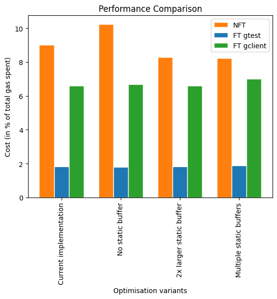

Here are some of the optimisation attempts we've tried:

1. [Measuring current performance](#current)
1. [Remove static buffer](#remove)
1. [Increase static buffer size by two](#increase)
1. [Multiple static buffers](#multiple)

## 0. Measuring current performance

We've measured the current [(commit 9135baa)](https://github.com/gear-tech/dlmalloc-rust/tree/9135baa728ef9a9a04a887998e019733c4b093af) performance of dlmalloc to have a baseline for comparison.
### How we measured

All optimisation attempts were tested 3 times on the different test cases, and the average of the results was used to compare the performance. Our main metric is gas consumption: the less gas is consumed, the better. All optimisations were measured in release mode binaries with most optimisations enabled and compared to current perfomance.

The gas measurements were made via `debug` and `gas_available` syscalls, which was temporarily made free. Each allocation top-level operation (i.e. malloc, calloc, ...) was measured separately, the gas was measured before and after function call and calculated as substraction result of gas before and gas after.

Then the gas consumption was calculated as a percentage of total gas spent on the test case.

We've intentionally did not put any info about testing machine, because we measure only gas consumption, which will be same for every machine, since we have fixed weights for every instruction and syscall.

The test cases were:
- `NFT init -> mint -> burn`: This test case is for measuring the performance of the NFT contract, which is the one of the common cases of smart contracts. The test case consists of the following steps:
  - `init`: Initialise the NFT contract.
  - `mint`: Mint 1 NFT.
  - `burn`: Burn 1 NFT.

  This is quite simple case and it's not the most common case, but it's the most simple case we can think of.

  You can see the code of the test case [here](https://github.com/gear-dapps/non-fungible-token/blob/0.2.10/tests/node_tests.rs) (`burn-test`).
- `FT stress-test` with <kbd>gtest</kbd>: This test case is for measuring the performance of the FT contract, which is also the one of the common cases of smart contracts. The test case consists of the following steps:
  - `init`: Initialise the FT contract.
  - `mint`: Mint 1 000 000 FT to the first user.
  - `transfer`: Transfer 6 000 FT to the first 20 accounts from first user.
  - `balance`: Check the balance of first account to prove it sent 6 000 FT to the first 20 accounts.
  - `balance`: Check the balance of first 20 accounts.
  - `transfer`: Transfer 1 000 FT from the first 20 accounts to users 21-100.
  - `balance`: Check the balance of first 20 accounts to prove it sent 1 000 FT to users 21-100.
  - `balance`: Check the balance of users 21-100 to prove they've received 1 000 FT from the first 20 accounts.
  - `mint`: Mint 1 000 000 FT to the second user. 
  - `mint`: Mint 5 000 FT to users 87..120.
  - `balance`: Check the balance of users 87..120 to prove they've received 5 000 FT after mint.
  - `transfer`: Transfer 1 000 FT from users 87..120 to the first user.
  - `total_supply`: Check the total supply of FT to prove it's sums up to correct value.
  - `balance`: Check the balance of users 918..13400
  - `mint`: Mint 5 000 FT to users 918..13400.
  - `transfer`: Transfer `i / 4` FT from users 918..13400 to the user `i * 2`.

  The next two steps were repeated 30 times:
  - `balance`: Check the balance of users 1..130
  - `transfer`: Transfer 1 FT from users 1..130 to the first user.

  This test tries to imitate what happens when the FT contract is used in the real world, with many clients and memory allocations therefore.

- `FT stress-test` with <kbd>gclient</kbd>: This test case has the same steps as the previous one, but it's executed with <kbd>gclient</kbd> instead of <kbd>gtest</kbd>. This test is most similar to the real world case, because it's executed with the real node and will give the most real gas usage. 

### Current performance

Here are the results of the current implementation of galloc (with static buffer):

| Test case | Allocator gas consumption |
| --- | --- |
| `NFT init -> mint -> burn` | 9.01% |
| `FT stress-test` with <kbd>gtest</kbd> | 1.82% |
| `FT stress-test` with <kbd>gclient</kbd> | 6.59% |

#### `NFT init -> mint -> burn`
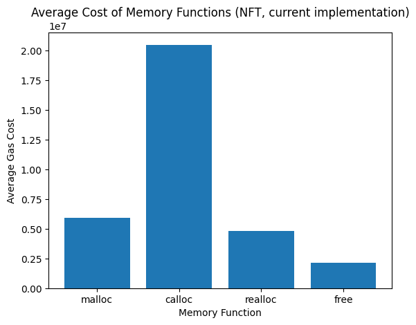
| | malloc        | calloc      | realloc          | free           |
| -------------------------- | ------------- | ----------- | ---------------- | -------------- |
| avg                        | 5 926 259     | 20 482 163  | 4 804 402        | 2 151 075      |
| min                        | 0             | 0           | 0                | 0              |
| max                        | 62 577 371    | 147 404 803 | 22 458 818       | 7 311 238      |
| count                      | 72            | 30          | 27               | 51             |
| total                       | 426 690 633   | 614 464 886 | 129 718 852      | 109 704 816    |
| % of total gas spent | 3,00%         | 4,32%       | 0,91%            | 0,77%          |

**Total gas spent:** 14 219 262 044

**Gas spent on allocations:** 1 280 579 187

#### `FT stress-test` with <kbd>gtest</kbd>
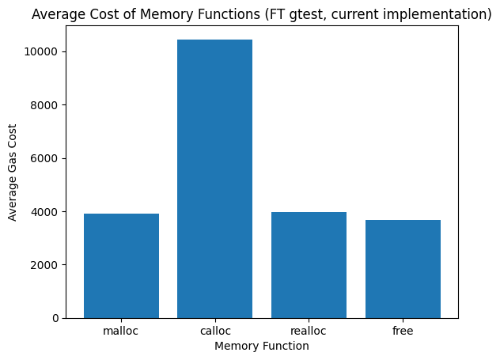
|       | malloc        | calloc      | realloc          | free            |
| -------------------------- | ------------- | ----------- | ---------------- | --------------- |
| avg                        | 3 897         | 10 445      | 3 975            | 3 672           |
| min                        | 3 538         | 9 730       | 3 878            | 3 647           |
| max                        | 106 135       | 10 882      | 3 975            | 5 764           |
| count                      | 115 347       | 57 668      | 115 357          | 113 720         |
| total                      | 449 507 259   | 602 358 274 | 458 542 814      | 417 614 736     |
| % of total gas spent | 0,42%         | 0,57%       | 0,43%            | 0,39%           |

**Total gas spent:** 105 932 492 358

**Gas spent on allocations:** 1 928 023 083

#### `FT stress-test` with <kbd>gclient</kbd>
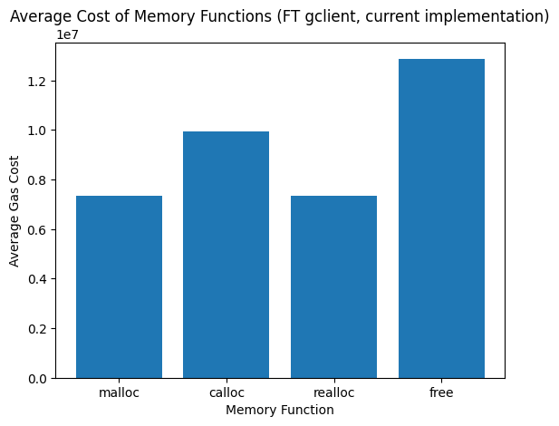
|  | malloc             | calloc            | realloc           | free                |
| -------------------------- | ------------------ | ----------------- | ----------------- | ------------------- |
| avg                        | 7 328 894          | 9 959 374         | 7 360 643         | 12 880 659          |
| min                        | 6 771 353          | 7 178 085         | 7 116 108         | 6 605 797           |
| max                        | 167 056 786        | 101 005 505       | 7 360 980         | 43 948 275          |
| count                      | 447 300            | 445 700           | 993 400           | 892 700             |
| total                      | 3 278 214 286 200  | 4 438 892 991 800 | 7 312 062 756 200 | 11 498 564 289 300  |
| % of total gas spent | 0,81%              | 1,10%             | 1,82%             | 2,86%               |

**Total gas spent:** 402 261 823 754 900

**Gas spent on allocations:** 26 527 734 323 500

[Go to top](#)

## 1. Remove static buffer

We've tried to remove static buffer and use only <kbd>dlmalloc</kbd>-like implementation, but it showed no significant performance improvement. In most cases, it even showed worse performance. So it seems that the static buffer is not the bottleneck.

### Test data

| Test case | Allocator gas consumption |
| --- | --- |
| `NFT init -> mint -> burn` | 10.24% |
| `FT stress-test` with <kbd>gtest</kbd> | 1.81% |
| `FT stress-test` with <kbd>gclient</kbd> | 6.69% |

#### `NFT init -> mint -> burn`

|| malloc        | calloc      | realloc          | free           |
| -------------------------- | ------------- | ----------- | ---------------- | -------------- |
| avg                        | 7 345 998     | 23 228 658  | 5 836 735        | 2 204 091      |
| min                        | 0             | 0           | 0                | 0              |
| max                        | 67 006 379    | 151 833 811 | 31 601 983       | 7 311 238      |
| count                      | 72            | 30          | 27               | 51             |
| total                      | 528 911 832   | 696 859 732 | 157 591 848      | 112 408 659    |
| % of total gas spent | 3,62%         | 4,77%       | 1,08%            | 0,77%          |

**Total gas spent:** 14 609 523 436

**Gas spent on allocations:** 1 495 772 071

#### `FT stress-test` with <kbd>gtest</kbd>
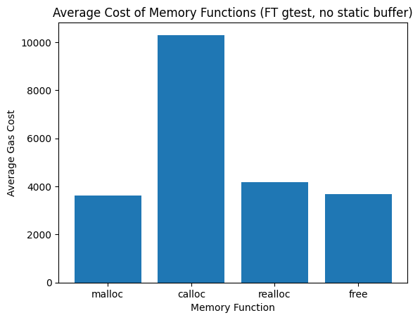

| | malloc        | calloc      | realloc          | free            |
| -------------------------- | ------------- | ----------- | ---------------- | --------------- |
| avg                        | 3 633         | 10 305      | 4 184            | 3 672           |
| min                        | 3 470         | 9 511       | 3 469            | 3 647           |
| max                        | 106 066       | 12 762      | 5 379            | 5 764           |
| count                      | 115 347       | 57 668      | 115 357          | 113 720         |
| total                      | 419 013 351   | 594 243 370 | 482 701 325      | 417 539 656     |
| % of total gas spent | 0,40%         | 0,56%       | 0,46%            | 0,40%           |

**Total gas spent:** 105 622 769 451

**Gas spent on allocations:** 1 913 497 702

#### `FT stress-test` with <kbd>gclient</kbd>
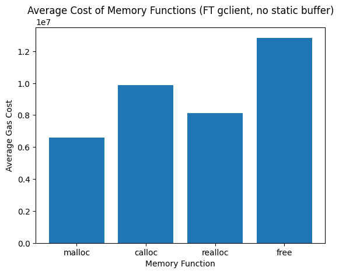

| | malloc             | calloc            | realloc           | free                |
| -------------------------- | ------------------ | ----------------- | ----------------- | ------------------- |
| avg                        | 6 594 974          | 9 874 272         | 8 126 747         | 12 842 147          |
| min                        | 6 301 422          | 7 572 938         | 6 399 106         | 6 605 797           |
| max                        | 166 930 089        | 100 884 991       | 55 643 720        | 43 948 275          |
| count                      | 447 300            | 445 700           | 993 400           | 892 700             |
| total                      | 2 949 931 870 200  | 4 400 963 030 400 | 8 073 110 469 800 | 11 464 184 626 900  |
| % of total gas spent | 0,73%              | 1,09%             | 2,01%             | 2,85%               |

**Total gas spent:** 401 929 928 086 200

**Gas spent on allocations:** 26 888 189 997 300
[Go to top](#)

## 2. Increase static buffer size by two

We've tried to increase static buffer size by two, and it's perfomance was slightly better than the current implementation. But it's not significant enough to change the current implementation.

### Tests data

| Test case | Allocator gas consumption |
| --- | --- |
| `NFT init -> mint -> burn` | 8.30% |
| `FT stress-test` with <kbd>gtest</kbd> | 1.82% |
| `FT stress-test` with <kbd>gclient</kbd> | 6.60% |

#### `NFT init -> mint -> burn`

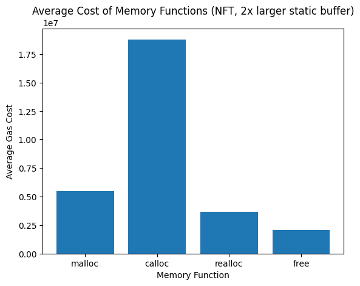

|  | malloc        | calloc      | realloc          | free           |
| -------------------------- | ------------- | ----------- | ---------------- | -------------- |
| avg                        | 5 506 150     | 18 799 874  | 3 658 917        | 2 085 685      |
| min                        | 0             | 0           | 0                | 0              |
| max                        | 60 757 769    | 145 585 201 | 20 639 216       | 7 311 238      |
| count                      | 72            | 30          | 27               | 51             |
| total                      | 396 442 770   | 563 996 230 | 98 790 750       | 106 369 960    |
| % of total gas spent | 2,82%         | 4,02%       | 0,70%            | 0,76%          |

**Total gas spent:** 14 037 042 257

**Gas spent on allocations:** 1 165 599 710

#### `FT stress-test` with <kbd>gtest</kbd>

| | malloc        | calloc      | realloc          | free            |
| -------------------------- | ------------- | ----------- | ---------------- | --------------- |
| avg                        | 3 897         | 10 445      | 3 975            | 3 672           |
| min                        | 3 509         | 9 701       | 3 878            | 3 647           |
| max                        | 106 135       | 10 882      | 3 975            | 5 764           |
| count                      | 115 347       | 57 668      | 115 357          | 113 720         |
| total                      | 449 505 807   | 602 358 162 | 458 542 814      | 417 614 556     |
| % of total gas spent | 0,42%         | 0,57%       | 0,43%            | 0,39%           |

**Total gas spent:** 105 942 871 878

**Gas spent on allocations:** 1 928 021 339

#### `FT stress-test` with <kbd>gclient</kbd>

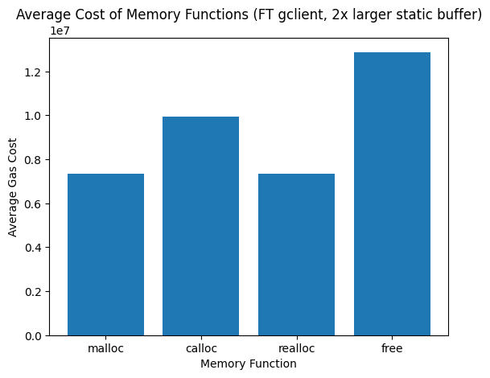

| | malloc             | calloc            | realloc           | free                |
| -------------------------- | ------------------ | ----------------- | ----------------- | ------------------- |
| avg                        | 7 328 883          | 9 959 385         | 7 360 629         | 12 880 657          |
| min                        | 6 721 051          | 7 129 901         | 6 978 562         | 6 605 797           |
| max                        | 167 056 786        | 101 005 505       | 7 360 980         | 43 948 275          |
| count                      | 447 300            | 445 700           | 993 400           | 892 700             |
| total                      | 3 278 209 365 900  | 4 438 897 894 500 | 7 312 048 848 600 | 11 498 562 503 900  |
| % of total gas spent | 0,82%              | 1,10%             | 1,82%             | 2,86%               |

**Total gas spent:** 402 127 166 124 400

**Gas spent on allocations:** 26 527 718 612 900

[Go to top](#)

## 3. Multiple static buffers

We've tried to implement not only one static buffer, but multiple static buffers, with different sizes. But the study showed that it's not worth the effort and most allocations was done in the largest static buffer, which perfomance was even worster to the current implementation.

The best-performed buffer combination was:
- 1-byte buffer with 2 cells
- 2-byte buffer with 2 cells
- 4-byte buffer with 4 cells
- 6-byte buffer with 4 cells
- 8-byte buffer with 8 cells
- 32-byte buffer with 4 cells

### Tests data

| Test case | Allocator gas consumption |
| --- | --- |
| `NFT init -> mint -> burn` | 8.23% |
| `FT stress-test` with <kbd>gtest</kbd> | 1.88% |
| `FT stress-test` with <kbd>gclient</kbd> | 7.01% |

#### `NFT init -> mint -> burn`

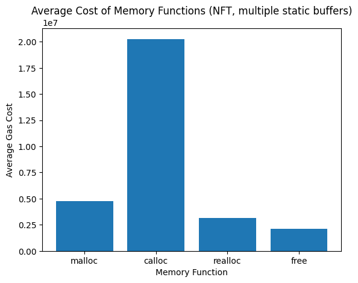

| | malloc        | calloc      | realloc          | free           |
| -------------------------- | ------------- | ----------- | ---------------- | -------------- |
| avg                        | 4 782 645     | 20 264 194  | 3 162 786        | 2 127 495      |
| min                        | 0             | 0           | 0                | 0              |
| max                        | 59 799 575    | 144 627 007 | 14 997 161       | 6 832 686      |
| count                      | 72            | 30          | 27               | 51             |
| total                      | 344 350 454   | 607 925 829 | 85 395 225       | 108 502 266    |
| % of total gas spent | 2,47%         | 4,37%       | 0,61%            | 0,78%          |

**Total gas spent:** 13 919 515 958

**Gas spent on allocations:** 1 146 173 774

#### `FT stress-test` with <kbd>gtest</kbd>

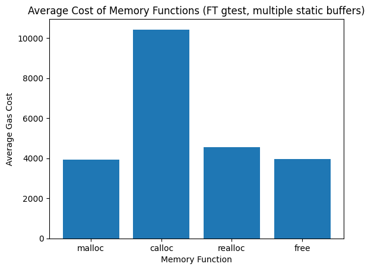

| FT stress-test gtest       | malloc        | calloc      | realloc          | free            |
| -------------------------- | ------------- | ----------- | ---------------- | --------------- |
| avg                        | 3 932         | 10 422      | 4 546            | 3 966           |
| min                        | 3 865         | 9 906       | 3 809            | 3 594           |
| max                        | 106 102       | 10 850      | 4 991            | 6 098           |
| count                      | 115 347       | 57 668      | 115 357          | 113 720         |
| total                      | 453 591 491   | 600 990 750 | 524 458 656      | 450 972 515     |
| % of total gas spent | 0,42%         | 0,56%       | 0,49%            | 0,42%           |

**Total gas spent:** 108 092 146 858

**Gas spent on allocations:** 2 030 013 412

#### `FT stress-test` with <kbd>gclient</kbd>

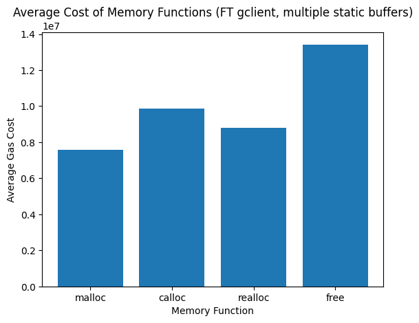

|   | malloc             | calloc            | realloc           | free                |
| -------------------------- | ------------------ | ----------------- | ----------------- | ------------------- |
| avg                        | 7 567 990          | 9 880 118         | 8 782 928         | 13 421 040          |
| min                        | 7 144 095          | 7 679 192         | 7 786 254         | 7 143 492           |
| max                        | 166 993 137        | 100 941 856       | 54 992 766        | 44 562 355          |
| count                      | 447 300            | 445 700           | 993 400           | 892 700             |
| total                      | 3 385 161 927 000  | 4 403 568 592 600 | 8 724 960 675 200 | 11 980 962 408 000  |
| % of total gas spent | 0,83%              | 1,08%             | 2,15%             | 2,95%               |

**Total gas spent:** 406 477 093 157 100

**Gas spent on allocations:** 28 494 653 602 800

[Go to top](#)

# Conclusion
We've tried to optimise galloc in some ways, but none of them showed significant performance improvement, so we'd suggest to keep the current implementation. All the tests showed that the current implementation is the best one.