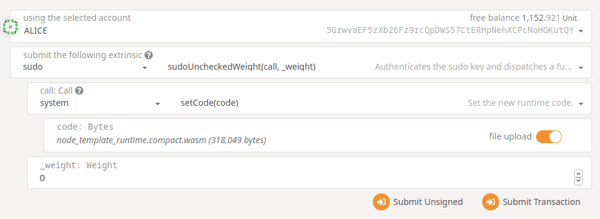

# Gear Node

Gear substrate-based node, ready for hacking :rocket:

## Installation

### 1. Build deps

#### Ubuntu/Debian
```
sudo apt update
# May prompt for location information
sudo apt install -y git clang curl libssl-dev llvm libudev-dev cmake protobuf-compiler
```

#### MacOS
```
# Install Homebrew if necessary https://brew.sh/
/bin/bash -c "$(curl -fsSL https://raw.githubusercontent.com/Homebrew/install/master/install.sh)"

# Make sure Homebrew is up-to-date, install openssl
brew update
brew install openssl
```

Additionally, if you use Apple Silicon (M1/M1 Pro/M1 Max), install Rosetta:
```
/usr/sbin/softwareupdate --install-rosetta --agree-to-license
```

#### Windows

Windows 10 is supported with WSL!

- Install WSL and upgrade it to version 2 use instructions from https://docs.microsoft.com/en-us/windows/wsl/install-win10.
- Ensure VM feature is enabled in bios in processor advanced menu.
- Install Ubuntu 20.04 LTS https://www.microsoft.com/store/apps/9n6svws3rx71.
- Launch installed app and setup root user - exit ubuntu app (first time launch takes time).
- Install windows terminal from app store or use VSCode with remote plugin (auto suggested once wsl is detected by VSCode).
- Follow instructions for linux.

### 2. Rust and all toolchains

Rustup if not installed:
```
# Install
curl https://sh.rustup.rs -sSf | sh
# Configure
source ~/.cargo/env
```

Toolchains:

```
rustup default stable
rustup update
rustup update nightly
rustup target add wasm32-unknown-unknown --toolchain nightly
```

## Test network

Test network is live. To run local node connected to test network, compile and launch node without parameters:

```
cargo build --release
./target/release/gear
```

## Dev Net

At the MVP stage, dev net is supported!

to run a dev net, compile and run `gear`:

```bash
cargo build --release
./target/release/gear --dev
```

Then follow to https://polkadot.js.org/ and connect to a local dev node.

How to program your gear node, see `EXAMPLES.md`

Purge any existing dev chain state:

```bash
./target/release/gear purge-chain --dev
```

Start a dev chain with detailed logging:

```bash
RUST_LOG=debug RUST_BACKTRACE=1 ./target/release/gear -lruntime=debug --dev
```

### Multi-Node Local Testnet

At the MVP stage, multinode testnet is also supported!

To see the multi-node consensus algorithm in action, run a local testnet with two validator nodes,
Alice and Bob, that have been [configured](./src/chain_spec.rs) as the initial
authorities of the `local` testnet chain and endowed with testnet units.

Note: this will require two terminal sessions (one for each node).

Start Alice's node first. The command below uses the default TCP port (30333) and specifies
`/tmp/alice` as the chain database location. Alice's node ID will be
`12D3KooWEyoppNCUx8Yx66oV9fJnriXwCcXwDDUA2kj6vnc6iDEp` (legacy representation:
`QmRpheLN4JWdAnY7HGJfWFNbfkQCb6tFf4vvA6hgjMZKrR`); this is determined by the `node-key`.

```bash
cargo run -- \
  --base-path /tmp/alice \
  --chain=local \
  --alice \
  --node-key 0000000000000000000000000000000000000000000000000000000000000001 \
  --telemetry-url 'ws://telemetry.polkadot.io:1024 0' \
  --validator
```

In another terminal, use the following command to start Bob's node on a different TCP port (30334)
and with a chain database location of `/tmp/bob`. The `--bootnodes` option will connect his node to
Alice's on TCP port 30333:

```bash
cargo run -- \
  --base-path /tmp/bob \
  --bootnodes /ip4/127.0.0.1/tcp/30333/p2p/12D3KooWEyoppNCUx8Yx66oV9fJnriXwCcXwDDUA2kj6vnc6iDEp \
  --chain=local \
  --bob \
  --port 30334 \
  --ws-port 9945 \
  --telemetry-url 'ws://telemetry.polkadot.io:1024 0' \
  --validator
```

Execute `cargo run -- --help` to learn more about the template node's CLI options.

### Upgrade

To perform a runtime upgrade, Substrate uses existing runtime logic to update
the Wasm runtime stored on the blockchain to a new consensus-breaking version with new logic.
This upgrade gets pushed out to all syncing nodes on the network as a part of the consensus process.
Once the Wasm runtime is upgraded, the executor will see that the native runtime `spec_name`, `spec_version`,
or `authoring_version` no longer matches this new Wasm runtime. As a result,
it will fall back to execute the canonical Wasm runtime instead of using the native runtime
in any of the execution processes.

Let's do the upgrade step by step:
1. First make sure your node is running. We are making a runtime upgrade anyway :)

2. Make required changes in code and don't forget to increment `spec_version` in `RuntimeVersion`.

3. Build your new node with
    ```bash
    cargo build --release -p gear-runtime
    ```
    It will be node state that we will be upgrading to.

    (Old node version is still running)

4. Now use [Polkadot JS Apps UI](https://polkadot.js.org/apps/#/extrinsics?rpc=ws://127.0.0.1:9944)
to automatically configure the UI to connect to the local node:

(Some ad blockers and browser restrictions (e.g. the built-in Shield in Brave browser,
and https requirement for socket connection in Firefox) interfere with connecting to a local node.
Make sure to check them and, if needed, turn them off.
You may not get connecting from a remote IP (like `polkadot.js.org/apps/`) to a local node working.
If you are unable to solve this, we encourage you to host your app locally, like [the apps UI](https://github.com/polkadot-js/apps#development))

Use related account to invoke the `sudoUncheckedWeight` function and use the `setCode` function from the
system pallet as its parameter. In order to supply the build artifact that was generated by the previous build step,
toggle the "file upload" switch on the right-hand side of the "code" input field for the parameter
to the `setCode` function. Click the "code" input field, and select one of the Wasm binaries that defines the upgraded runtime:

```bash
target/release/wbuild/gear-runtime/gear_runtime.compact.wasm
```
Leave the value for the `weight` parameter at the default of `0x00`. Click "Submit Transaction" and then "Sign and Submit".



After the transaction has been included in a block, the version number in the upper-left-hand corner of Polkadot
    JS Apps UI should reflect that the runtime version is now corresponding to the number you have set on step 2.

If you still see your node producing blocks in the terminal it's running and reported on the UI,
you have performed a successful forkless runtime upgrade! Congrats!!!
