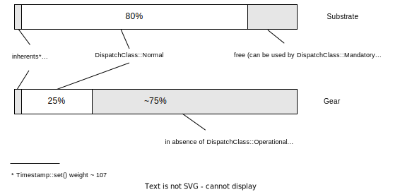

# Gear block proposer and builder.

This crate provides an extended implementations of the original Substrate's [`BlockBuilder`](https://docs.rs/sc-block-builder/latest/sc_block_builder/struct.BlockBuilder.html) utility and the corresponding runtime api, and a custom implementation of the [`Proposer`](https://docs.rs/sp-consensus/latest/sp_consensus/trait.Proposer.html) trait.

The need for an custom implementations arises from the fact that in Gear a special pseudo-inherent exists that has to be added at the end of each block after all the normal extrinsics have been pushed. Furthermore, to guarantee consistent block production, this pseudo-inherent must not step beyond the block proposing deadline defined by the node client. This requires additional functionality that is not provided by the original `BlockBuilder` utility.

## Overview

For the correct network functioning it is crucial that blocks are created in each time slot.
This requires synchronization between the node client (which operates in terms of milli and nano-seconds) and the `Runtime`
whose notion of time is represented by the block `Weight`.

In the default Substrate's implementation the deadline for the block creation goes through a series of transformations before the proposer actually gets to applying extrinsics to fill the block:

<p align="lift">
    
</p>

The original "source of truth" in terms of the block creation time is the same - the `SLOT_DURATION` runtime constant. Eventually, the time allocated for processing of extirnsics of all `DispatchClass`'es will constitute almost exactly 1/3 of the overall block time. The same idea is true for the `Runtime` - the `MAXIMUM_BLOCK_WEIGHT` constant calculated as 1/3 of the total possible block `Weight`:

```
`  time, |                        weight |
`    ms  |                               |
`        |                               |
`   3000 |------|                 3*10^12|------|
`        |      |                        |      |
`        |      |                        |      |
`        |      |                        |      |
`        |      |                        |      |
`    980 |------|- proposal        10^12 |------|- max_block
`        |//////|   deadline             |//////|
`        |//////|                        |//////|
`      0 --------------------------------------------
```

As long as this synchronization between how the client counts the remaining time and the `Runtime` that tracks the current block weight (provided the extrinsics benchmarking is adequate) is maintained, we can be almost sure the block timing is consistent: the `DispatchClass::Normal` extrinsics by default are allowed to take up to 80% of the weight, the rest being taken by the inherents, therefore the probability of exhausting the weight before the time has run out (and vise versa) is relatively low.
The finalization of the block is not supposed to be included in this time frame.

## Gear specifics

In Gear we have a special pseudo-inherent that is called `Gear::run()` and has to be added at the end of each block after all the normal (or operational) extrinsics have been pushed. This pseudo-inherent is responsible for processing the message queue.

The `Runtime` specifies the so-called `NORMAL_DISPATCH_WEIGHT_RATIO` constant that defines the share of the `DispatchClass::Normal` extrinsics in the overall block weight. In Gear this constant is set to 25% (as opposed to the default 80% in Substrate). This means that the want the `DispatchClass::Normal` extrinsics to take up to 25% of the block time, leaving the rest to `DispatchClass::Mandatory` (including the `Gear::run()`) and `DispatchClass::Operational` extrinsics.

<p align="lift">
    
</p>

The question, therefore, is how we should partition the proposal `duration` in the `BlockBuilder` (in terms of time) to maintain the desired proportion between the extrinsics application and the message queue processing.

In the ideal world the synchronization between the time taken so far by the proposer and the used weight is always maintained so that we can rely on the `Runtime` weights to predict how many more extrinsics we can take from the transaction pool so that the `Gear::run()` has as much time as it thinks it has to do messages processing.

<p align="lift">
    
</p>


In reality though, a discrepancy between actual time and weight can grow as extrinsics are being applied.

In case we have more "conservative" weights we can end up having under-populated blocks (the block weight is exhausted much earlier than the actual time deadline).

The opposite situation is more dangerous: it can turn out that by the time we start skipping extrinsics (by being close to the block weight limit for the `DispatchClass::Normal` extrinsics) we have already almost hit the deadline for the block proposal (and way passed the `soft_deadline` however small that one might be, because the `soft_deadline` is only checked after we have already skipped enough extrinsics). Even more so, if we happen to hit the deadline for the block proposal, the `Gear::run()` will run anyway, assuming it still has 3/4 of the block time to spend whereas in reality it has none.

Another issue is how to impose a deadline on the `Gear::run()` itself because it also has a time budget - 3/4 of the proposal duration, but it operates in terms of gas (which is assumed to be just another representation of weight), and once started running, it won't stop until it has burned all the remaining gas allowance.

## Custom Proposer implementation

There are two main invariants the `BlockBuilder` implementation should enforce to keep the block timing consistent:
- the `Gear::run()` pseudo-inherent always runs with a certain "honest" units of gas. By "honest" we mean that there is sufficient time left inside the block proposing, equivalent to this amount of gas. Ideally, this amount of gas should be equal or exceed the 3/4 of the `max_total` per block;
- the `Gear::run()` can only spill over the desired block proposal deadline up to some well-defined "slippage".

To guarantee these invariants, we suggest the following approach:
- In addition to the overall proposal "hard" deadline introduce another "hard" deadline (as opposed to the existing `soft_deadline` which has a specific meaning and will remain) to limit the normal extrinsics application time to protect ourselves from the situation when the weight for the `DispatchClass:Normal` extrinsics hasn't been exhausted while timing-wise this stage has taken more than expected. In most cases, however, this deadline is never supposed to be hit, provided the benchmarked weights of all the extrinsics are correct;
- In case the normal extrinsics application stage hit the deadline, we can't anymore rely on the remaining block `gas_allowance` in the `Runtime`; if we did, the `Gear::run()` would think it has more gas to spend when it actually does. Therefore, we need to adjust the gas budget for the `Gear::run()` by passing it an explicit `Some(max_gas)` parameter;
- To calculate the extrinsic stage deadline, we can use a "relaxed" version of the `NORMAL_DISPATCH_WEIGHT_RATIO` constant, say, 35% instead of 25%. This means that in the worst case, if we have run the extrinsics application phase for the entire 35% of the block proposal duration, we can then still let the `Gear::run()` run for 3/4 of the original proposal duration thereby expecting to exceed the ultimate deadline by 10% tops, which is still affordable given we have 1/3 of the `SlotProportion` for the block finalization and are never supposed to use up all of that. This `max_slippage` percentage can be made configurable;
- To calculate the `max_gas` for the `Gear::run()` we have to resort to heuristic knowledge of the `time` to `gas` conversion: 1 pico-second is equivalent to 1 unit of gas. Therefore, the reasonable expectation is that if we manually set the `max_gas` to `7.5*10^11`, the `Gear::run()` will run for `750 ms`, or 3/4 of the block proposal duration so that the ultimate "relaxed" deadline is not exceeded;
- Despite the `max_gas` provided explicitly, we still make the `Gear::run()` to execute against a timeout to avoid skipping the entire block. The timeout will be set to the same value in pico-seconds as the `max_gas` absolute value. If triggered, the `Gear::run()` will be dropped entirely and all the changes in the storage overlay will be reverted. However, this is a very much undesirable situation and should be avoidedm because it'll lead to the message queue inflation, higher latency and transaction cost.

The `soft_deadline` for the extrinsics application phase can be left at `50%`, as it is in the default Substrate block authorship implementation to serve the same purpose.
